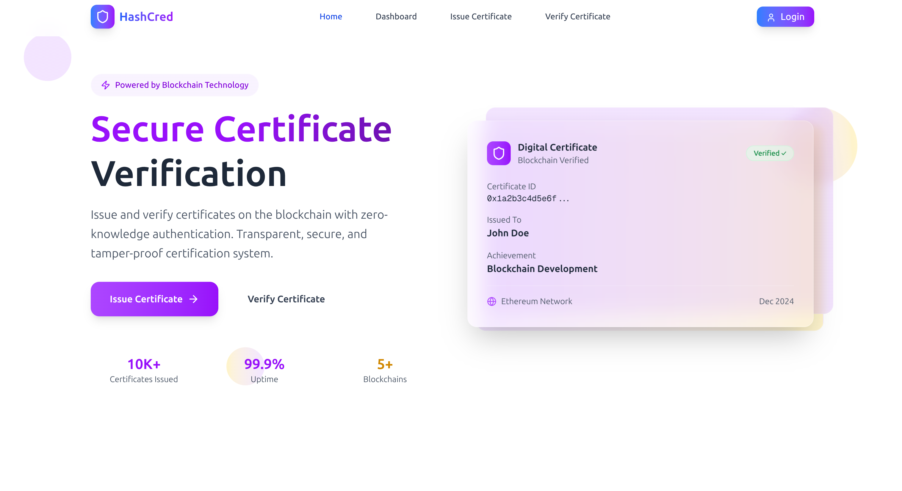

# HashCred



## Table of Contents

* [Problem Statement](#problem-statement)
* [Our Proposal](#our-proposal)
* [Technologies Used](#technologies-used)
* [zkLogin SUI](#zklogin-sui)
* [Certificate Issuance](#certificate-issuance)
* [Admin Role](#admin-role)
* [How Are We Different?](#how-are-we-different)

---

## Problem Statement

The proliferation of certificate forgery in the modern internet era has become increasingly prevalent. Employers face significant challenges verifying certificates issued by various institutions due to overly complex, closed verification systems, inconsistent data formats, and a lack of a unified, transparent, accessible framework.

In short: it sucks. We want to fix this.

---

## Our Proposal

We propose a Web3-based certification platform built on the Layer 1 SUI blockchain. It enables employers to access and verify all publicly issued certificates issued by legitimate authorities.

Key features:

* zkLogin for privacy-preserving authentication
* Smart contracts for transparency, immutability, and tamper-proof verification
* Intuitive search interface using unique user IDs (no public email exposure)

---

## Technologies Used

* Next.js 15
* Tailwind CSS v4
* Node.js 22
* Uploadthing (file uploads)
* Drizzle ORM
* SUI Blockchain

---

## zkLogin SUI

SUI’s zkLogin enables passwordless authentication leveraging OAuth providers (Google, Facebook, Twitch) with zero-knowledge proofs, ensuring users prove identity without exposing unnecessary personal data.

Only minimal data like certificate images, email, and zkLoginPublicAddress are stored, and emails are **never** exposed on-chain. The system uses OpenID Connect 2.0 for interoperability and strong security.

### 1. OAuth Provider

* User selects Google or Facebook on `/sign-in`
* Redirect to OpenID Connect auth endpoint with a nonce from an ephemeral key-pair

### 2. Ephemeral Key Pair Generation and Storage

* Generate `maxEpoch`, `ephemeralKeyPair`, `randomness` and store locally under `"ephemeral-key-pair"`
* Allows regeneration of zkLogin address & signature while epoch is valid

```ts
import { generateNonce, generateRandomness } from '@mysten/sui/zklogin';

const suiClient = new SuiClient({ url: FULLNODE_URL });
const { epoch } = await suiClient.getLatestSuiSystemState();

const maxEpoch = Number(epoch) + 2;
const ephemeralKeyPair = new Ed25519Keypair();
const randomness = generateRandomness();
const nonce = generateNonce(ephemeralKeyPair.getPublicKey(), maxEpoch, randomness);
```

### 3. Construction of zkLogin Address

* OAuth provider redirects to `/auth`, JWT is extracted and fragment stripped
* Retrieve ephemeral key pair, derive salt, zkLoginUserAddress, and partialZkLoginSignature

```ts
const { ephemeralKeyPair, maxEpoch, randomness } = stored;
const ExtendedEphemeralKeyPair = getExtendedEphemeralPublicKey(ephemeralKeyPair.getPublicKey());
const { salt } = await GetSalt(jwt);
const zkLoginUserAddress = jwtToAddress(jwt, salt);
const proofResponse = await CallZkpRoute({
  jwt, network: NETWORK, maxEpoch, randomness, ephemeralPublicKey: ExtendedEphemeralKeyPair,
});
const partialZkLoginSignature = proofResponse as PartialZkLoginSignature;
```

### 4. Sponsored Transaction

* Construct a transaction transferring 1 MIST to the user’s zkLogin address to finalize it on-chain

```ts
const trx = new Transaction();
const [coin] = trx.splitCoins(trx.gas, [1]);
trx.transferObjects([coin], zkLoginUserAddress);
const bytes = await trx.build({ client, onlyTransactionKind: true });
const { bytes: sponsoredBytes, signature: sponsorSig } = await GetSponsorFromBackend({
  sender: zkLoginUserAddress,
  transactionKindBytes: bytes,
});
const newTrx = Transaction.from(sponsoredBytes);
```

### 5. Login

* Call `/api/auth/` to verify JWT signature against the OAuth provider’s JWKS using the JWT header’s `kid`
* Create a new user record if email not found
* If user exists, check if current epoch > `maxEpoch`; if so, append new zkLoginAddress
* Save user session securely with http-only cookies
* Redirect to `/dashboard`

---

## Certificate Issuance


---

## Admin Role


---

## How Are We Different?

* **Unified & Open Verification:** Unlike fragmented or closed university/blockchain projects, HashCred offers a transparent, interoperable, and public platform built on SUI blockchain, accessible to all employers.
* **Privacy-First Authentication:** We leverage zkLogin with zero-knowledge proofs to authenticate users without exposing sensitive personal data on-chain, unlike systems that publicly store emails or PII.
* **Epoch-based Address Management:** Our innovative use of epochs allows seamless address rotation and user key management, improving security without user friction.
* **Intuitive Search & UX:** Employers verify certificates using unique user IDs, eliminating complexity and speeding up hiring workflows.
* **Open Source & Modular:** We provide open tooling and documentation, empowering educational institutions and third parties to issue certificates transparently.


